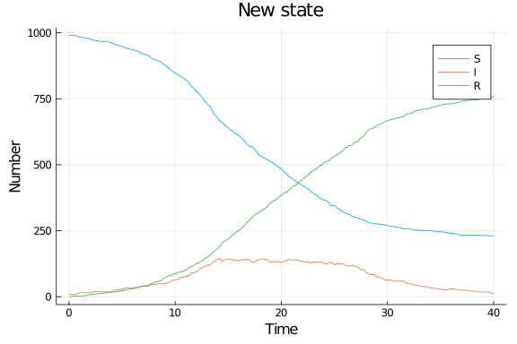
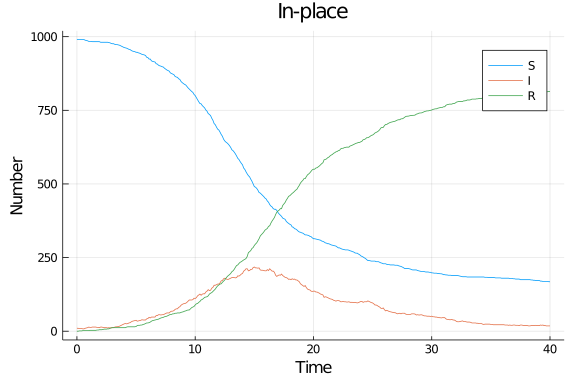

# Agent-based model using standard Julia
Simon Frost (@sdwfrost), 2020-05-03

## Introduction

The agent-based model approach is:

- Stochastic
- Discrete in time
- Discrete in state

## Libraries

````julia
using Distributions
using StatsBase
using Random
using DataFrames
using StatsPlots
using BenchmarkTools
````


## Utility functions

````julia
function rate_to_proportion(r::Float64,t::Float64)
    1-exp(-r*t)
end;
````


## Transitions

As this is a simple model, the global state of the system is a vector of infection states, defined using an `@enum`.

````julia
@enum InfectionStatus Susceptible Infected Recovered
````


This is an inefficient version that returns a new state vector.

````julia
function sir_abm(u,p,t)
    du = deepcopy(u)
    (β,c,γ,δt) = p
    N = length(u)
    for i in 1:N # loop through agents
        # If recovered
        if u[i]==Recovered continue
        # If susceptible
        elseif u[i]==Susceptible
            ncontacts = rand(Poisson(c*δt))
            idx = sample(1:N,ncontacts,replace=false)
            for j in 1:length(idx)
                if j==i continue end
                a = u[idx[j]]
                if a==Infected && rand() < β
                    du[i] = Infected
                    break
                end
            end
        # If infected
    else u[i]==Infected
            if rand() < γ
                du[i] = Recovered
            end
        end
    end
    du
end;
````


This function is an in-place version.

````julia
function sir_abm!(du,u,p,t)
    (β,c,γ,δt) = p
    N = length(u)
    for i in 1:N # loop through agents
        # If recovered
        if u[i]==Recovered
            du[i] = u[i]
        # If susceptible
        elseif u[i]==Susceptible
            ncontacts = rand(Poisson(c*δt))
            idx = sample(1:N,ncontacts,replace=false)
            for j in 1:length(idx)
                if j==i continue end
                a = u[idx[j]]
                if a==Infected && rand() < β
                    du[i] = Infected
                    break
                end
            end
        # If infected
    else u[i]==Infected
            if rand() < γ
                du[i] = Recovered
            else
                du[i] = u[i]
            end
        end
    end
    nothing
end;
````


## Time domain

````julia
δt = 0.1
nsteps = 400
tf = nsteps*δt
tspan = (0.0,nsteps)
t = 0:δt:tf;
````


## Parameter values

````julia
β = 0.05
c = 10.0
γ = rate_to_proportion(0.25,δt)
p = [β,c,γ,δt]
````


````
4-element Array{Float64,1}:
  0.05
 10.0
  0.024690087971667385
  0.1
````


## Initial conditions

````julia
N = 1000
I0 = 10
u0 = Array{InfectionStatus}(undef,N)
for i in 1:N
    if i <= I0
        s = Infected
    else
        s = Susceptible
    end
    u0[i] = s
end
````


## Random number seed

````julia
Random.seed!(1234);
````


## Running the model

We need some reporting functions.

````julia
susceptible(x) = count(i == Susceptible for i in x)
infected(x) = count(i == Infected for i in x)
recovered(x) = count(i == Recovered for i in x);
````


This runs the version that generates new state vectors.

````julia
function sim(u0,nsteps,dt)
    u = copy(u0)
    t = 0.0
    ta = []
    Sa = []
    Ia = []
    Ra =[]
    push!(ta,t)
    push!(Sa,susceptible(u))
    push!(Ia,infected(u))
    push!(Ra,recovered(u))
    for i in 1:nsteps
        u=sir_abm(u,p,t)
        t = t + dt
        push!(ta,t)
        push!(Sa,susceptible(u))
        push!(Ia,infected(u))
        push!(Ra,recovered(u))
    end
    DataFrame(t=ta,S=Sa,I=Ia,R=Ra)
end
````


````
sim (generic function with 1 method)
````


Now, the in-place version.

````julia
function sim!(u0,nsteps,dt)
    u = copy(u0)
    du = copy(u0)
    t = 0.0
    ta = []
    Sa = []
    Ia = []
    Ra =[]
    push!(ta,t)
    push!(Sa,susceptible(u))
    push!(Ia,infected(u))
    push!(Ra,recovered(u))
    for i in 1:nsteps
        sir_abm!(du,u,p,t)
        u,du = du,u
        t = t + dt
        push!(ta,t)
        push!(Sa,susceptible(u))
        push!(Ia,infected(u))
        push!(Ra,recovered(u))
    end
    DataFrame(t=ta,S=Sa,I=Ia,R=Ra)
end
````


````
sim! (generic function with 1 method)
````


````julia
df_abm = sim(u0,nsteps,δt);
````


````julia
df_abm! = sim!(u0,nsteps,δt);
````


## Plotting


````julia
@df df_abm plot(:t,
    [:S :I :R],
    label=["S" "I" "R"],
    xlabel="Time",
    ylabel="Number",
    title="New state")
````




````julia
@df df_abm! plot(:t,
    [:S :I :R],
    label=["S" "I" "R"],
    xlabel="Time",
    ylabel="Number",
    title="In-place")
````





## Benchmarking

````julia
@benchmark sim(u0,nsteps,δt);
````


````julia
@benchmark sim!(u0,nsteps,δt);
````


## Appendix
### Computer Information
```
Julia Version 1.4.0
Commit b8e9a9ecc6 (2020-03-21 16:36 UTC)
Platform Info:
  OS: Windows (x86_64-w64-mingw32)
  CPU: Intel(R) Core(TM) i7-8550U CPU @ 1.80GHz
  WORD_SIZE: 64
  LIBM: libopenlibm
  LLVM: libLLVM-8.0.1 (ORCJIT, skylake)
Environment:
  JULIA_NUM_THREADS = 4

```

### Package Information

```
Status `~\.julia\environments\v1.4\Project.toml`
[46ada45e-f475-11e8-01d0-f70cc89e6671] Agents 3.0.0
[b19378d9-d87a-599a-927f-45f220a2c452] ArrayFire 1.0.6
[c52e3926-4ff0-5f6e-af25-54175e0327b1] Atom 0.12.10
[6e4b80f9-dd63-53aa-95a3-0cdb28fa8baf] BenchmarkTools 0.5.0
[be33ccc6-a3ff-5ff2-a52e-74243cff1e17] CUDAnative 3.0.4
[3a865a2d-5b23-5a0f-bc46-62713ec82fae] CuArrays 2.0.1
[717857b8-e6f2-59f4-9121-6e50c889abd2] DSP 0.6.6
[2445eb08-9709-466a-b3fc-47e12bd697a2] DataDrivenDiffEq 0.2.0
[a93c6f00-e57d-5684-b7b6-d8193f3e46c0] DataFrames 0.20.2
[aae7a2af-3d4f-5e19-a356-7da93b79d9d0] DiffEqFlux 1.8.1
[41bf760c-e81c-5289-8e54-58b1f1f8abe2] DiffEqSensitivity 6.13.0
[6d1b261a-3be8-11e9-3f2f-0b112a9a8436] DiffEqTutorials 0.1.0
[0c46a032-eb83-5123-abaf-570d42b7fbaa] DifferentialEquations 6.13.0
[31c24e10-a181-5473-b8eb-7969acd0382f] Distributions 0.23.2
[634d3b9d-ee7a-5ddf-bec9-22491ea816e1] DrWatson 1.10.2
[587475ba-b771-5e3f-ad9e-33799f191a9c] Flux 0.10.4
[0c68f7d7-f131-5f86-a1c3-88cf8149b2d7] GPUArrays 3.1.0
[28b8d3ca-fb5f-59d9-8090-bfdbd6d07a71] GR 0.48.0
[523d8e89-b243-5607-941c-87d699ea6713] Gillespie 0.1.0
[7073ff75-c697-5162-941a-fcdaad2a7d2a] IJulia 1.21.2
[e5e0dc1b-0480-54bc-9374-aad01c23163d] Juno 0.8.1
[d8e11817-5142-5d16-987a-aa16d5891078] MLStyle 0.4.0
[961ee093-0014-501f-94e3-6117800e7a78] ModelingToolkit 3.0.2
[429524aa-4258-5aef-a3af-852621145aeb] Optim 0.20.6
[1dea7af3-3e70-54e6-95c3-0bf5283fa5ed] OrdinaryDiffEq 5.34.1
[91a5bcdd-55d7-5caf-9e0b-520d859cae80] Plots 1.0.12
[e6cf234a-135c-5ec9-84dd-332b85af5143] RandomNumbers 1.4.0
[c5292f4c-5179-55e1-98c5-05642aab7184] ResumableFunctions 0.5.1
[428bdadb-6287-5aa5-874b-9969638295fd] SimJulia 0.8.0
[05bca326-078c-5bf0-a5bf-ce7c7982d7fd] SimpleDiffEq 1.1.0
[2913bbd2-ae8a-5f71-8c99-4fb6c76f3a91] StatsBase 0.33.0
[f3b207a7-027a-5e70-b257-86293d7955fd] StatsPlots 0.14.5
[789caeaf-c7a9-5a7d-9973-96adeb23e2a0] StochasticDiffEq 6.19.2
[44d3d7a6-8a23-5bf8-98c5-b353f8df5ec9] Weave 0.9.4
[37e2e46d-f89d-539d-b4ee-838fcccc9c8e] LinearAlgebra
[cf7118a7-6976-5b1a-9a39-7adc72f591a4] UUIDs
```
