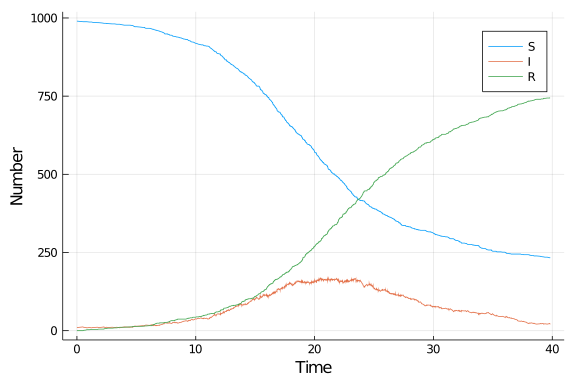

# Discrete event simulation using SimJulia
Simon Frost (@sdwfrost), 2020-04-27

## Libraries

````julia
using ResumableFunctions
using SimJulia
using Distributions
using DataFrames
using Random
using StatsPlots
using BenchmarkTools
````


## Utility functions

````julia
function increment!(a::Array{Int64})
    push!(a,a[length(a)]+1)
end

function decrement!(a::Array{Int64})
    push!(a,a[length(a)]-1)
end

function carryover!(a::Array{Int64})
    push!(a,a[length(a)])
end;
````


## Transitions

````julia
mutable struct SIRPerson
    id::Int64 # numeric ID
    status::Symbol # :S,I,R
end;
````


````julia
mutable struct SIRModel
    sim::Simulation
    β::Float64
    c::Float64
    γ::Float64
    ta::Array{Float64}
    Sa::Array{Int64}
    Ia::Array{Int64}
    Ra::Array{Int64}
    allIndividuals::Array{SIRPerson}
end
````


These functions update the state of the 'world' when either an infection or recovery occurs.

````julia
function infection_update!(sim::Simulation,m::SIRModel)
    push!(m.ta,now(sim))
    decrement!(m.Sa)
    increment!(m.Ia)
    carryover!(m.Ra)
end;
````


````julia
function recovery_update!(sim::Simulation,m::SIRModel)
    push!(m.ta,now(sim))
    carryover!(m.Sa)
    decrement!(m.Ia)
    increment!(m.Ra)
end;
````


The following is the main simulation function. It's not efficient, as it involves activating a process for all susceptibles; a more efficient algorithm would involve just considering infected individuals, and activating each susceptible individual when infection occurs. This however requires more bookkeeping and detracts from the ability to easily compare between implementations.

````julia
@resumable function live(sim::Simulation, individual::SIRPerson, m::SIRModel)
  while individual.status==:S
      # Wait until next contact
      @yield timeout(sim,rand(Distributions.Exponential(1/m.c)))
      # Choose random alter
      alter=individual
      while alter==individual
          N=length(m.allIndividuals)
          index=rand(Distributions.DiscreteUniform(1,N))
          alter=m.allIndividuals[index]
      end
      # If alter is infected
      if alter.status==:I
          infect = rand(Distributions.Uniform(0,1))
          if infect < m.β
              individual.status=:I
              infection_update!(sim,m)
          end
      end
  end
  if individual.status==:I
      # Wait until recovery
      @yield timeout(sim,rand(Distributions.Exponential(1/m.γ)))
      individual.status=:R
      recovery_update!(sim,m)
  end
end;
````


````julia
function MakeSIRModel(u0,p)
    (S,I,R) = u0
    N = S+I+R
    (β,c,γ) = p
    sim = Simulation()
    allIndividuals=Array{SIRPerson,1}(undef,N)
    for i in 1:S
        p=SIRPerson(i,:S)
        allIndividuals[i]=p
    end
    for i in (S+1):(S+I)
        p=SIRPerson(i,:I)
        allIndividuals[i]=p
    end
    for i  in (S+I+1):N
        p=SIRPerson(i,:R)
        allIndividuals[i]=p
    end
    ta=Array{Float64,1}(undef,0)
    push!(ta,0.0)
    Sa=Array{Int64,1}(undef,0)
    push!(Sa,S)
    Ia=Array{Int64,1}(undef,0)
    push!(Ia,I)
    Ra=Array{Int64,1}(undef,0)
    push!(Ra,R)
    SIRModel(sim,β,c,γ,ta,Sa,Ia,Ra,allIndividuals)
end;
````


````julia
function activate(m::SIRModel)
     [@process live(m.sim,individual,m) for individual in m.allIndividuals]
end;
````


````julia
function sir_run(m::SIRModel,tf::Float64)
    SimJulia.run(m.sim,tf)
end;
````


````julia
function out(m::SIRModel)
    result = DataFrame()
    result[!,:t] = m.ta
    result[!,:S] = m.Sa
    result[!,:I] = m.Ia
    result[!,:R] = m.Ra
    result
end;
````


## Time domain

````julia
tmax = 40.0;
````


## Initial conditions

````julia
u0 = [990,10,0];
````


## Parameter values

````julia
p = [0.05,10.0,0.25];
````


## Random number seed

````julia
Random.seed!(1234);
````


## Running the model

````julia
des_model = MakeSIRModel(u0,p)
activate(des_model)
sir_run(des_model,tmax)
````


## Postprocessing

````julia
data_des=out(des_model);
````


## Plotting

````julia
@df data_des plot(:t,
    [:S :I :R],
    labels = ["S" "I" "R"],
    xlab="Time",
    ylab="Number")
````





## Benchmarking

````julia
@benchmark begin
    des_model = MakeSIRModel(u0,p)
    activate(des_model)
    sir_run(des_model,tmax)
end
````


````
BenchmarkTools.Trial: 
  memory estimate:  72.74 MiB
  allocs estimate:  2189698
  --------------
  minimum time:     2.021 s (0.88% GC)
  median time:      2.096 s (0.90% GC)
  mean time:        2.149 s (0.88% GC)
  maximum time:     2.330 s (0.86% GC)
  --------------
  samples:          3
  evals/sample:     1
````


## Appendix
### Computer Information
```
Julia Version 1.4.0
Commit b8e9a9ecc6 (2020-03-21 16:36 UTC)
Platform Info:
  OS: Windows (x86_64-w64-mingw32)
  CPU: Intel(R) Core(TM) i7-8550U CPU @ 1.80GHz
  WORD_SIZE: 64
  LIBM: libopenlibm
  LLVM: libLLVM-8.0.1 (ORCJIT, skylake)
Environment:
  JULIA_NUM_THREADS = 4

```

### Package Information

```
Status `~\.julia\environments\v1.4\Project.toml`
[46ada45e-f475-11e8-01d0-f70cc89e6671] Agents 3.0.0
[b19378d9-d87a-599a-927f-45f220a2c452] ArrayFire 1.0.6
[c52e3926-4ff0-5f6e-af25-54175e0327b1] Atom 0.12.10
[6e4b80f9-dd63-53aa-95a3-0cdb28fa8baf] BenchmarkTools 0.5.0
[be33ccc6-a3ff-5ff2-a52e-74243cff1e17] CUDAnative 3.0.4
[3a865a2d-5b23-5a0f-bc46-62713ec82fae] CuArrays 2.0.1
[717857b8-e6f2-59f4-9121-6e50c889abd2] DSP 0.6.6
[2445eb08-9709-466a-b3fc-47e12bd697a2] DataDrivenDiffEq 0.2.0
[a93c6f00-e57d-5684-b7b6-d8193f3e46c0] DataFrames 0.20.2
[aae7a2af-3d4f-5e19-a356-7da93b79d9d0] DiffEqFlux 1.8.1
[41bf760c-e81c-5289-8e54-58b1f1f8abe2] DiffEqSensitivity 6.13.0
[6d1b261a-3be8-11e9-3f2f-0b112a9a8436] DiffEqTutorials 0.1.0
[0c46a032-eb83-5123-abaf-570d42b7fbaa] DifferentialEquations 6.13.0
[31c24e10-a181-5473-b8eb-7969acd0382f] Distributions 0.23.2
[634d3b9d-ee7a-5ddf-bec9-22491ea816e1] DrWatson 1.10.2
[587475ba-b771-5e3f-ad9e-33799f191a9c] Flux 0.10.4
[0c68f7d7-f131-5f86-a1c3-88cf8149b2d7] GPUArrays 3.1.0
[28b8d3ca-fb5f-59d9-8090-bfdbd6d07a71] GR 0.48.0
[523d8e89-b243-5607-941c-87d699ea6713] Gillespie 0.1.0
[7073ff75-c697-5162-941a-fcdaad2a7d2a] IJulia 1.21.2
[e5e0dc1b-0480-54bc-9374-aad01c23163d] Juno 0.8.1
[d8e11817-5142-5d16-987a-aa16d5891078] MLStyle 0.4.0
[961ee093-0014-501f-94e3-6117800e7a78] ModelingToolkit 3.0.2
[429524aa-4258-5aef-a3af-852621145aeb] Optim 0.20.6
[1dea7af3-3e70-54e6-95c3-0bf5283fa5ed] OrdinaryDiffEq 5.34.1
[91a5bcdd-55d7-5caf-9e0b-520d859cae80] Plots 1.0.12
[e6cf234a-135c-5ec9-84dd-332b85af5143] RandomNumbers 1.4.0
[c5292f4c-5179-55e1-98c5-05642aab7184] ResumableFunctions 0.5.1
[428bdadb-6287-5aa5-874b-9969638295fd] SimJulia 0.8.0
[05bca326-078c-5bf0-a5bf-ce7c7982d7fd] SimpleDiffEq 1.1.0
[2913bbd2-ae8a-5f71-8c99-4fb6c76f3a91] StatsBase 0.33.0
[f3b207a7-027a-5e70-b257-86293d7955fd] StatsPlots 0.14.5
[789caeaf-c7a9-5a7d-9973-96adeb23e2a0] StochasticDiffEq 6.19.2
[44d3d7a6-8a23-5bf8-98c5-b353f8df5ec9] Weave 0.9.4
[37e2e46d-f89d-539d-b4ee-838fcccc9c8e] LinearAlgebra
[cf7118a7-6976-5b1a-9a39-7adc72f591a4] UUIDs
```
